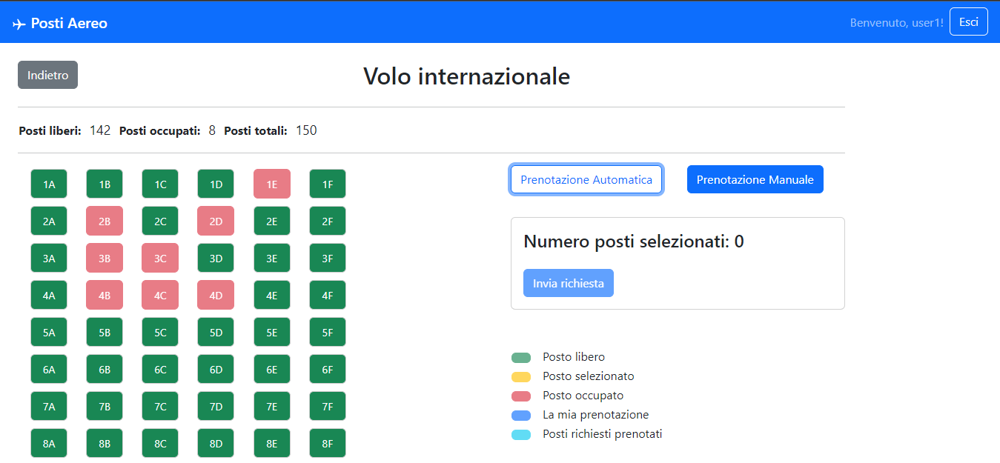

# Exam #2: "Posti aereo"
## Student: s3150067 MESSINEO NUNZIO 

Istruzioni per l'uso:
```sh
git clone ...yourCloneURL...
cd ...yourProjectDir...
git pull origin main  # just in case the default branch is not main 
(cd server ; npm install; nodemon index.mjs)
(cd client ; npm install; npm run dev)
## React Client Application Routes
```

- Route `/voli`: pagina contenente la selezione dei voli con i link alle pagine dei voli
- Route `/voli/locale`: pagina relativa al volo locale
- Route `/voli/regionale`: pagina relativa al volo regionale
- Route `/voli/internazionale`: pagina relativa al volo internazionale
- Route `/login`: pagina di login

## API Server

  # API per la connessione al database e per la gestione delle sessioni

- POST `/api/sessions`
  - Questa route permette di autenticare un utente.
  - request
    - parametri: nessuno
    - body: json {credentials} con all'interno username e password dell'utente da autenticare
  - response 
    - body: json {user} dati dell'utente autenticato
- GET `/api/sessions/current`
  - Questa route controlla se l'utente è connesso o meno.
  - request
    - parametri: nessuno
    - body: nessuno
  - response
    - body: json {user} dati dell'utente autenticato
- DELETE `/api/session/current` 
  - Questa route permette di disconnettere l'utente.
  - request
    - parameters: nessuno
    - body: nessuno
  - response 
    - body: nessuno

  # API per la gestione dei voli

  - GET `/api/voli/:tipoVolo/dati`
    - Questa route permette di ottenere i dati relativi ai voli.
    - request
      - parametri: tipoVolo
      - body: nessuno
    - response
      - body: json {listaPostiOccupati, File, Posti} dati relativi ai voli

  - GET `/api/voli/:tipoVolo/prenota`
    - Questa route permette di ottenere la prenotazione effettuata dall'utente per un determinato volo.
    - request
      - parametri: tipoVolo
      - body: nessuno
    - response
      - body: json {prenotazione} dati relativi alla prenotazione effettuata dall'utente

  - DELETE `/api/voli/:tipoVolo/cancella`
    - Questa route permette di eliminare la prenotazione effettuata dall'utente per un determinato volo.
    - request
      - parametri: tipoVolo
      - body: nessuno
    - response
      - body: nessuno

  - POST `/api/voli/:tipoVolo/auto`
    - Questa route permette di effettuare la prenotazione automatica dei posti per un determinato volo.
    - request
      - parametri: tipoVolo
      - body: N (numero di posti da prenotare)
    - response
      - body: json {prenotazione} dati relativi alla prenotazione effettuata dall'utente
    - error
      - body: vettore dei posti già prenotati tra quelli richiesti dall'utente (anche se non è possibile)

  - POST `/api/voli/:tipoVolo/man`
    - Questa route permette di effettuare la prenotazione manuale dei posti per un determinato volo.
    - request
      - parametri: tipoVolo
      - body: json {posti} vettore dei posti da prenotare
    - response
      - body: json {prenotazione} dati relativi alla prenotazione effettuata dall'utente
    - error
      - body: vettore dei posti già prenotati tra quelli richiesti dall'utente


## Database Tables

- Table `USERS` (
	"id"	INTEGER NOT NULL UNIQUE,
	"email"	TEXT NOT NULL UNIQUE,
	"name"	TEXT NOT NULL,
	"hash"	TEXT NOT NULL,
	"salt"	TEXT,
	PRIMARY KEY("id" AUTOINCREMENT)
);

- Table `PRENOTAZIONI`(
	"UserID"	INTEGER NOT NULL,
	"TipoVolo"	TEXT NOT NULL,
	"Fila"	INTEGER NOT NULL,
	"Posto"	INTEGER NOT NULL,
	PRIMARY KEY("Posto","Fila","TipoVolo")
);

- Table  `Voli` (
	"TipoVolo"	TEXT NOT NULL UNIQUE,
	"File"	INTEGER NOT NULL,
	"Posti"	INTEGER NOT NULL,
	PRIMARY KEY("TipoVolo")
); 
  - Considero come chiave il tipo volo perché nel caso semplificato in questione ci possono essere solo 3 tipi di volo (locale, regionale, internazionale). Nel caso di più voli per tipo di volo, si sarebbe dovuto aggiunger un id.

- Table  `Posti` (
	"Fila"	INTEGER NOT NULL,
	"Posto"	INTEGER NOT NULL,
	"TipoVolo"	TEXT NOT NULL,
	"Status"	TEXT NOT NULL,
	PRIMARY KEY("Posto","Fila","TipoVolo")
);

## Main React Components

- `App` (in `App.jsx`): componente per la gestione delle route con all'interno anche la useEffect usata per il controllo della sessione
- `SelezioneVoli` (in `PageLayout.jsx`): componente utilizzato per la visualizzazione della selezione dei voli in MainLayout
- `PostiAereo` (in `PageLayout.jsx`): componente principale dell'applicazione dove viene implementato tutto il backend ed il frontend, viene chiamato dai componenti relativi ai voli (Locale, Regionale, Internazionale). All'interno possiede due useEffect una che ogni volta che si entra nella route setta a true il flag Dirty e l'altra che ha come dipendenza proprio quest'ultima variabile e va ad aggiornare tutti i dati relativi ai voli. 
- `LocaleLayout` (in `PageLayout.jsx`): componente per la gestione della route relativa al volo locale, definisce delle variabili che vengono passate come props al componente PostiAereo
- `RegionaleLayout` (in `PageLayout.jsx`): componente per la gestione della route relativa al volo regionale, definisce delle variabili che vengono passate come props al componente PostiAereo
- `InternazionaleLayout` (in `PageLayout.jsx`): componente per la gestione della route relativa al volo internazionale, definisce delle variabili che vengono passate come props al componente PostiAereo
- `LoginForm` (in `Auth.jsx`): componente per la gestione del login

(only _main_ components, minor ones may be skipped)

## Screenshot



## Users Credentials

| User | Email | Password |
|-----------|-----------|-----------|
| user1  | user1@polito.it | password1  | 
| user2  | user2@polito.it | password2  | 
| user3  | user3@polito.it | password3  | 
| user4  | user4@polito.it | password4  | 

